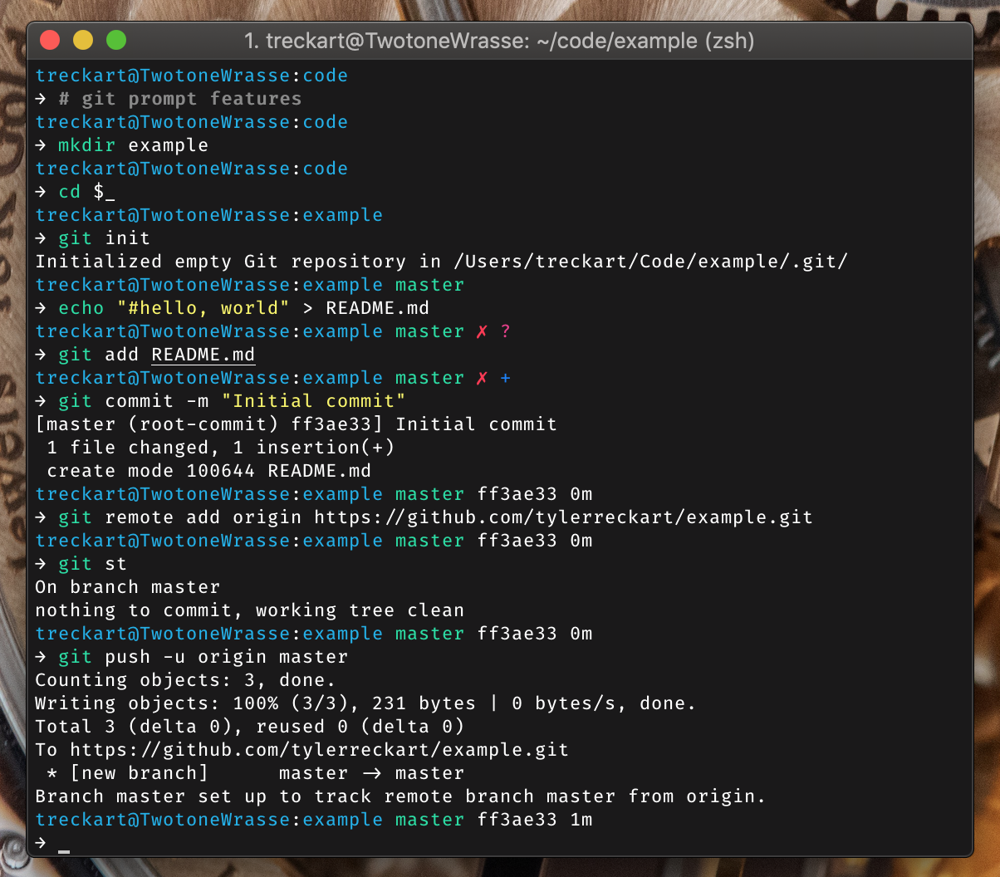

# Gondolin ZSH  
`gondolin-zsh` is a ZSH theme designed around a git-focused workflow. It is
inspired by the [gondolin](https://github.com/tylerreckart/gondolin) theme
built for the [elvish](https://elv.sh) prompt.  

  

Currently it shows:
* Current working directory
* Current Git branch and rich repo status in prompt readline. 
  * `?` — untracked changes;
  * `+` — uncommitted changes in the index;
  * `!` — unstaged changes;
  * `»` — renamed files;
  * `✘` — deleted files;
  * `§` — unmerged changes;
  * `⇡` — ahead of remote branch;
  * `⇣` — behind of remote branch;
  * `⇕` — diverged changes.
* Current Git SHA
* Colorized time since last commit
* A red marker (`✗`) if last command exits with non-zero code.

## Installation  
### Install using antigen
Just add `antigen theme tylerreckart/gondolin-zsh` to your `zshrc`.

### Install using `oh-my-zsh`
First, clone the repository into Oh-My-Zsh's themes directory.
```
$ git clone https://github.com/tylerreckart/gondolin-zsh.git ~/.oh-my-zsh/custom/themes/gondolin-zsh
```
You'll then need to select this theme in your `~/.zshrc`.
```
ZSH_THEME="gondolin-zsh/gondolin`
```
